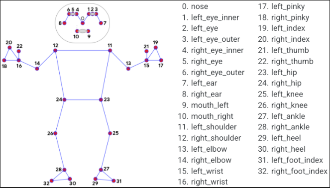

# Elbow Angles Detection Using Pose Estimation

# Summary
In this innovative project, I leverage the power of computer vision to precisely measure the angles of the elbow joints in human arms. The foundation of our solution lies in the integration of the OpenPose model, a cutting-edge technology capable of accurately detecting and tracking key body joints from images or video streams.

# Overview
- Demo
- Joints Diagram

# Demo 

# Joints Diagram

|  |
| :--: |
| *Pose Estimation Joints Diagram* |

# Video File Link:
https://drive.google.com/file/d/1HrP6zjakzOJAmTAKJDoIkcpVqFQCmPPk/view?usp=sharing